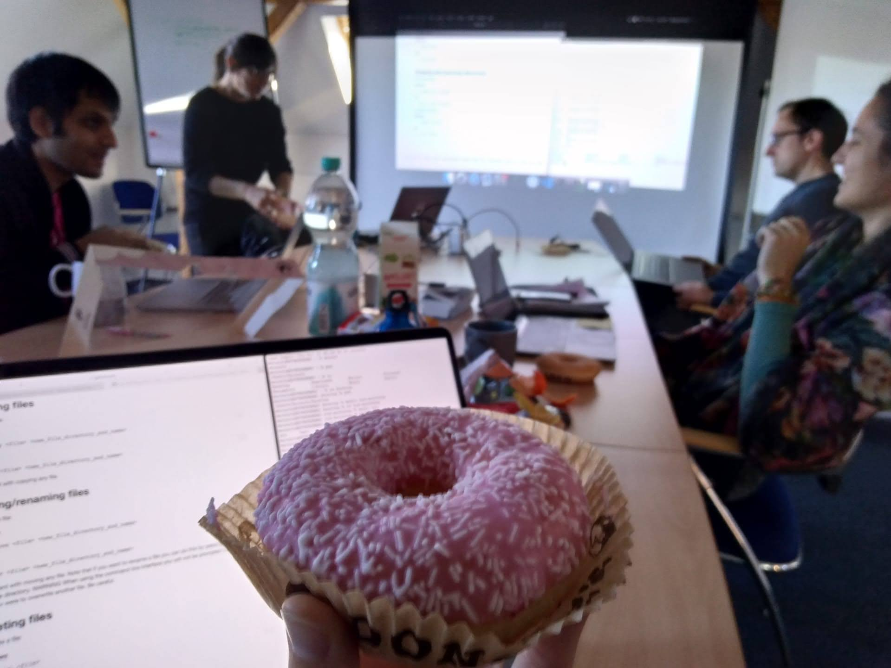

Software has become an important aspect of research and as more research is
based on results that are generated by software, there must be an increased
focus on developing software that is reliable and which can be easily proven to
produce reproducible results.

Last month, 22nd and 23rd of October, our group organized a two day workshop
which introduced various concepts of research software development.

The workshop was delivered by one of our team members, and a fellow of the <a
href="https://www.software.ac.uk">Sustainable Software Institute</a>, Nikoleta
Glynatsi.

All the resources can be found here:
<a href="https://github.com/Nikoleta-v3/rsd-workshop">https://github.com/Nikoleta-v3/rsd-workshop</a>.

The workshop itself introduced a number of concepts such as:

- Use of the command line;
- Modularity, documentation and automated testing of code;
- Version control;
- Use of GitHub.

In the future, our group aims to incorporate these concepts into our
workflows, and to (hopefully) create a group GitHub account where the source code
for all our published papers will be available to use and contribute to(as
suggested by <a href="https://twitter.com/jgreiter">Johannes Reiter</a>).

Nevertheless, our group learnt a lot in those two days, we had fun and consumed
an appropriate amount of sugar.

