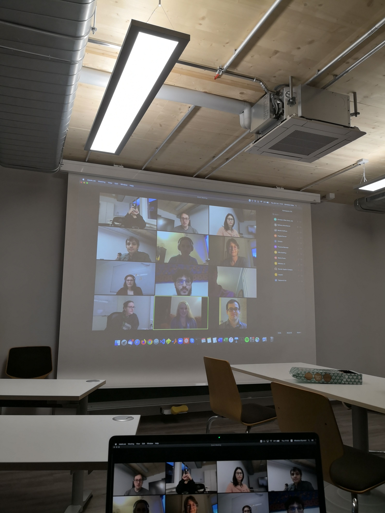

For our group seminar last week, we organised a talk led by <a href="https://www.bethanyburum.com">Dr. Bethany Burum</a> from the Department of Psychology at Harvard University, and <a href="https://sites.google.com/site/hoffmanmoshe/">Dr. Moshe Hoffman</a> as a co-speaker. Currently working at the interface of psychology, moral philosophy, and evolutionary game theory, the speakers presented a number of lab experiments that can help explain the puzzles of ineffective giving, strategic ignorance (avoiding information that would lead us to be more prosocial) and the difference between acts of commission (killing) and those of omission (letting die). As they conclude, constraints on social rewards such as conditioning on behaviors that are well-defined, readily observable, and commonly known, might be the ultimate evolutionary explanations for these questions. We thank Bethany and Moshe for the interesting and insightful discussion!

Check out authors' last paper <a href="https://www.nature.com/articles/s41562-020-00950-4">here</a>!

