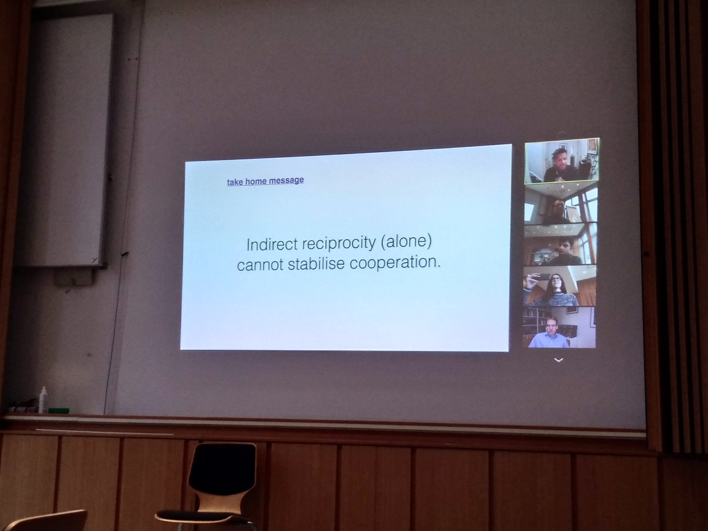

On Decmeber 9, <a href="https://garciajulian.com/">Dr. Julian Garcia</a> from the Faculty of Information Technology, Monash University, Australia gave a virtual presentation in our weekly group meeting. The event was open to everyone at the institute.  

Dr. Garcia is a familiar face at Max Planck Institute for Evolutionary Biology. He was formerly a post-doctoral researcher at Dr. Arne Traulsen’s Evolutionary Theory group in Plön.  

On Wednesday, Dr. Garcia talked about his current research on indirect reciprocity. Indirect reciprocity is a well studied mechanism of evolution of cooperation. It helps us to understand how reputation of individuals can be important in growth and maintenance of cooperative behaviour in a population. In current models of indirect reciprocity, individuals assign reputations to other individuals based on norms. It has been previously <a href="https://www.sciencedirect.com/science/article/pii/S0022519305003474?casa_token=ip4QVCOVz-IAAAAA:7kS7m1JXQbAB1enG3uHjTePYCj2IzynPSOWs1qQtQRMN-wsZsRBB-r6qBPseZYSAIB868is">shown</a> that certain norms lead to high levels of stable cooperation. However, in these models, it is always assumed that norms are uniform and do not evolve. Dr. Garcia’s work shows that undesirable social outcomes can arise when agents are allowed to freely adopt novel norms (a bottom’s up reputation dynamics approach). The results suggest that indirect reciprocity, by itself, is not sufficient to enable stable cooperation. It is necessary to consider other mechanisms alongside indirect reciprocity to accurately explain cooperative human behaviour.  

We thank Dr. Garcia for his exciting talk. You can find Dr. Garcia's paper <a href="http://www.ifaamas.org/Proceedings/aamas2019/pdfs/p269.pdf">here</a>.

