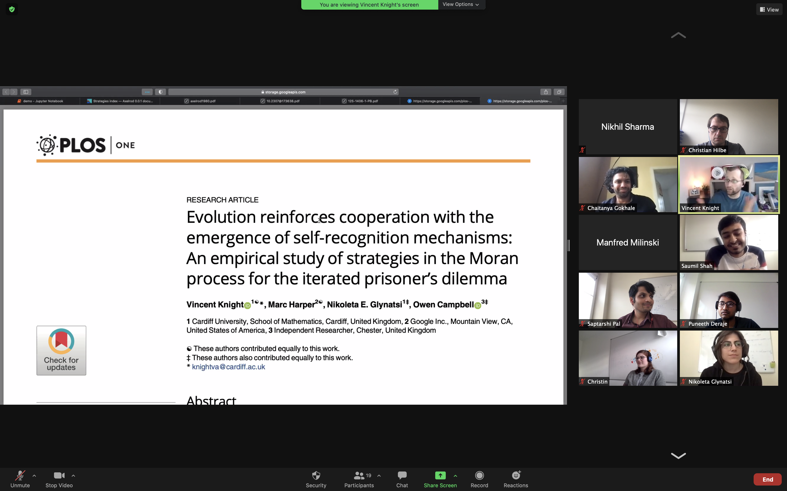

On January 21, <a href="https://vknight.org/"> Vince Knight </a> of Cardiff University gave a virtual talk on “Reproducing Research on Cooperation”. It was a great opportunity to learn how robust Axelrod’s seminal results on the repeated prisoner’s dilemma are. 

Dr. Vince Knight is a senior lecturer at Cardiff University and a fellow of the sustainable software institute. Among many other things, he is well-known because he is one of the main contributors to the Axelrod Python library. To the members of our group, Dr. Knight is also known as the PhD supervisor of our Post-Doc, Nikoleta Glynatsi. So, for many reasons, he clearly does great work, and we were very grateful to have him.

In his talk, Dr. Knight introduced us to the Axelrod Python library (and to reproducible software development more generally). The library can be used to re-run and to extend Axelrod’s tournaments (which are the basis of Axelrod’s famous book, “The evolution of cooperation”). In particular, Dr. Knight demonstrated how the classical winner of the tournament, Tit-for-Tat, can easily fail if minor modifications to the rules are made. In addition, he showed us how one can use machine learning to generate new winning strategies for the repeated prisoner’s dilemma. After his talk, he was happy to chat with us to give us more insights on his work. 

Dr. Knight’s talk was very engaging and clear, and we particularly enjoyed the discussion afterwards. Here are the <a href="https://vknight.org/speak/2021-01-21-reproducing-research-on-cooperation/main.pdf"> slides.</a>
Thanks so much! 

