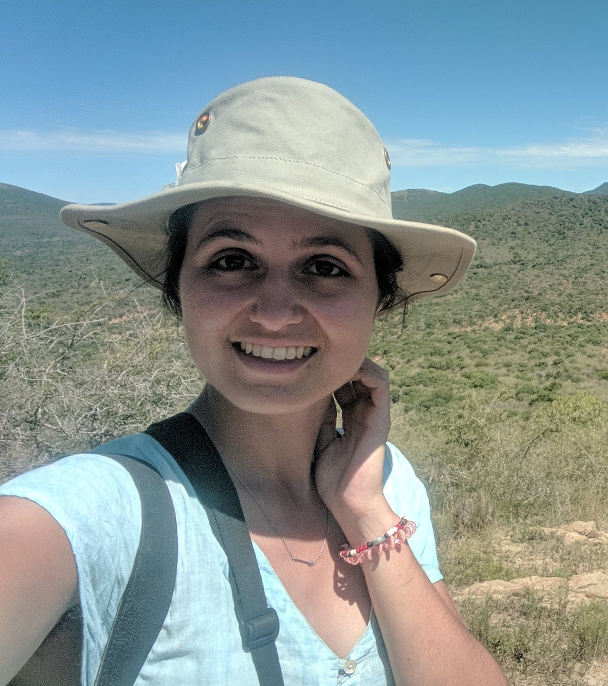

<h4>Charlotte S. L. Rossetti</h4>

    

    I am a PhD student and I joined the Research Group on Dynamics of Social Behaviour in 2020.
    I am an experimentalist with a background in psychology and behavioural economics. 
    

    

    I graduated with a Bachelor in Psychology from the University of Nottingham
    and a Master in Behavioural and Economic Science from the University of Warwick. 
    

    

    My research interest is in human and non-human strategic and social behaviour,
    specifically Behavioural and Evolutionary Game Theory.   During my PhD I aim to investigate
    human cooperative behaviour by running economic games while learning about linking experimental
    results with evolutionary models.
    

    

    I am originally from Geneva, Switzerland
    but I have lived in the UK for the past 6 years before coming to the Institute.
    

    

    <a href="rossetti@evolbio.mpg.de" title="Email"><i style="font-size:24px" class="fa fa-envelope"></i></a>

