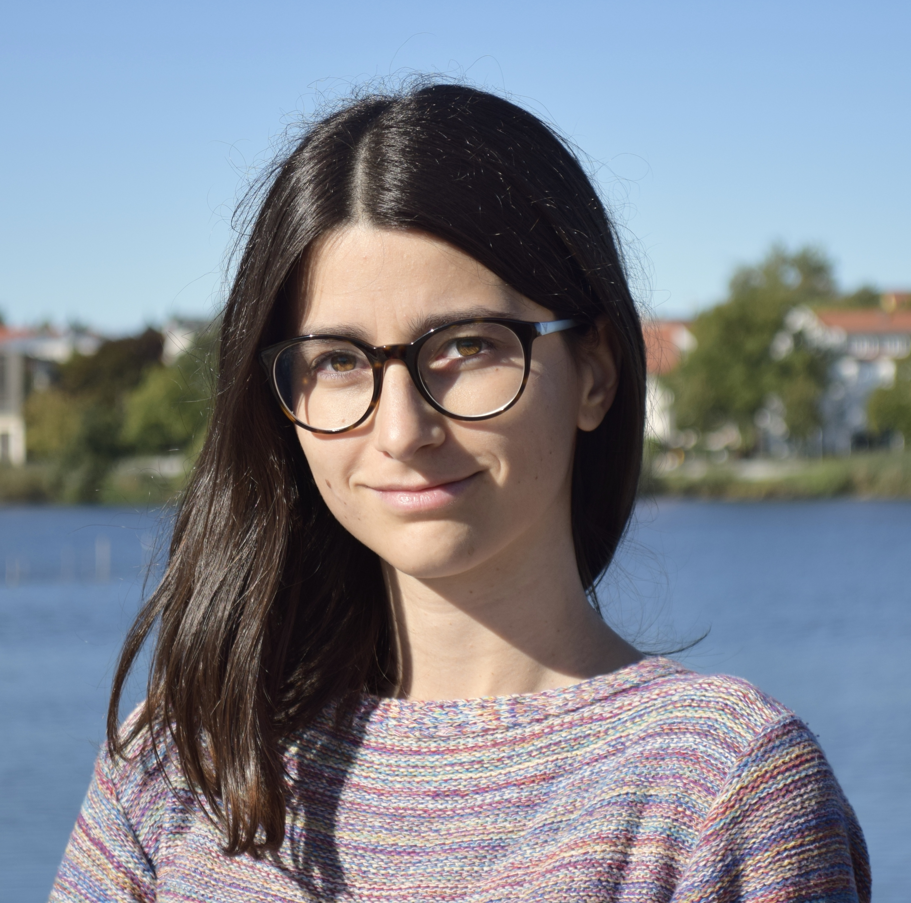

My name is Marta Couto, I am originally from Porto (Portugal) and I am a PhD candidate at Dynamics of Social Behavior Research Group. I am interested in understanding a bit of the complex world we live in. Currently, I am working in mathematical models of cooperation, specifically on the dynamics among heterogeneous individuals, resorting to the framework of Evolutionary Game Theory.
 
I am a physicist by training (BSc by University of Porto and MSc by Instituto Superior Técnico, Lisbon). In my MSc project, I studied the evolution of cooperation through sanctioning institutions on collective dilemmas with Dr Francisco C. Santos and Dr Jorge M. Pacheco. 

    <a href="mccouto@evolbio.mpg.de" title="Email"><i style="font-size:24px" class="fa fa-envelope"></i></a>
    <a href="https://www.researchgate.net/profile/Marta_Couto3" title="ResearchGate"><i style="font-size:24px" class="fa fa-researchgate"></i></a>

