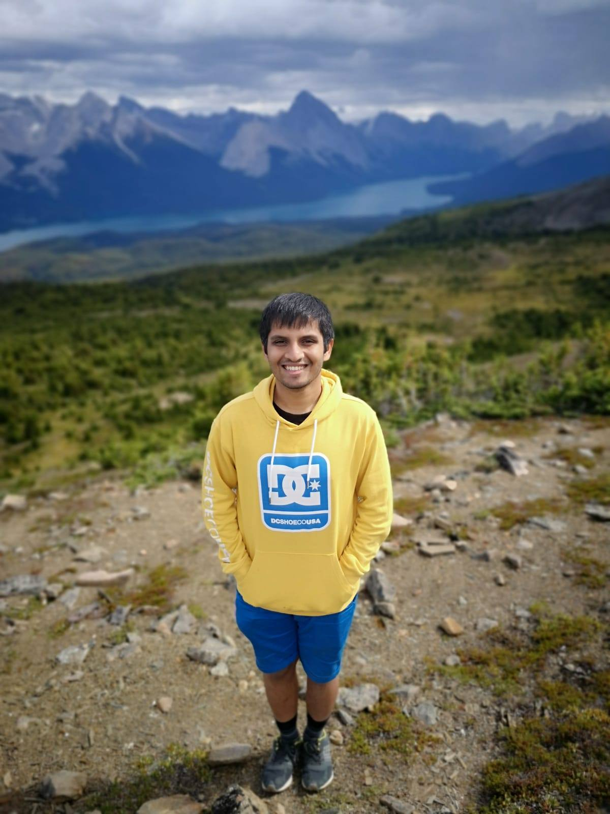

Hi! This is Saptarshi. I am currently working on the evolution of cooperation through reputation and indirect reciprocity. I am currently a PhD Student registered at CAU Kiel. 

I received my masters degree from the Faculty of Mathematics at the University of Waterloo, Canada in 2020. My thesis, titled [Global land use and the future of sustainable consumption: projections of a coupled social-land use model](https://uwspace.uwaterloo.ca/handle/10012/16278), can be found upon visiting the clicakble link.

I am currently working with mathematical models that try to understand how social rewarding and reputations can together sustain cooperation in a population that is involved in the two-player exchange or the public goods game.

I am from Kolkata, India. Apart from my work, I love playing chess, biking and listening to music. Please find my email below if you are interested in a chat! 

    <a href="pal@evolbio.mpg.de" title="Email"><i style="font-size:24px" class="fa fa-envelope"></i></a>
    <a href="https://twitter.com/saptarshipal_" title="Twitter"><i style="font-size:24px" class="fa fa-twitter"></i></a>
    <a href="https://www.linkedin.com/in/saptarshi-pal-1b2008a5/" title="LinkedIn"><i style="font-size:24px" class="fa fa-linkedin"></i></a>

