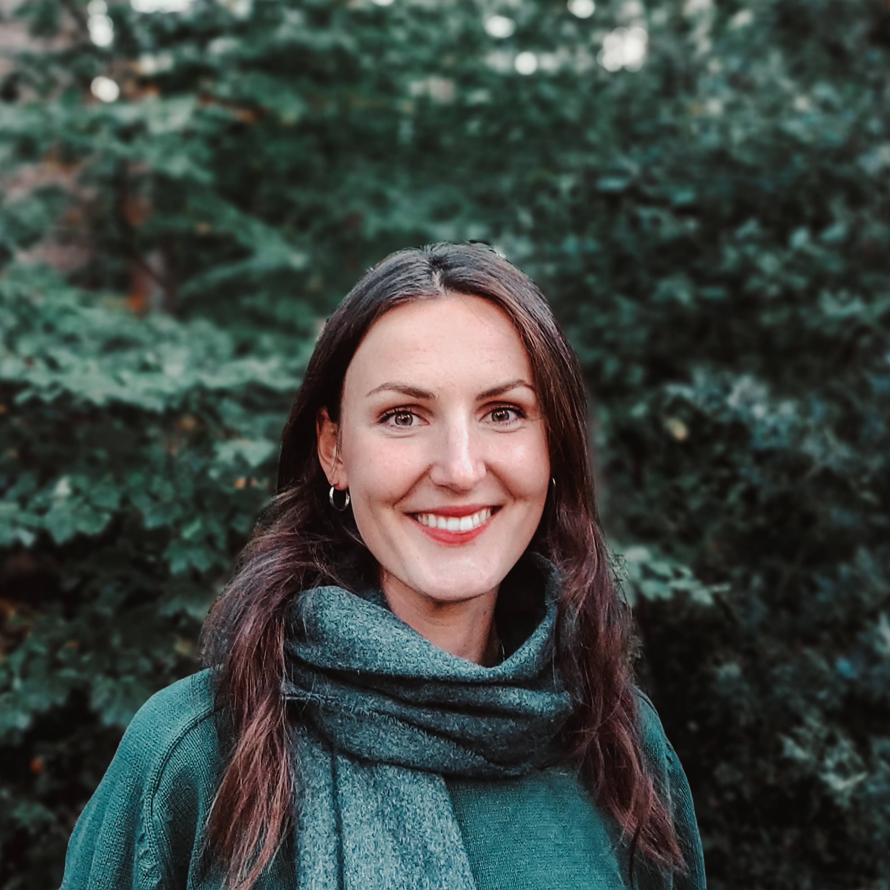

My name is Vivien Kleinow. I am a Neuroscience Master's student. I obtained two first degrees in Psychology (B.Sc.) and European Studies and Economics (B.Sc.) and I joined the Research Group Dynamics of Social Behavior in 2022.
 
I worked as a student assistant in the field of dynamic social learning at the MPI for Evolutionary Anthropology in Leipzig and in the field of Human-AI Interaction at the Fraunhofer Institute IWU. In my BSc Psychology project, I focused on biopsychology and sociometrics using dynamic data of human spatial behavior. 

    <a href="mailto:kleinow@evolbio.mpg.de"><i style="font-size:24px" class="fa fa-envelope"></i></a>
    <a href="https://twitter.com/vivknow"><i style="font-size:24px" class="fa fa-twitter"></i></a>
    <a href="https://www.linkedin.com/in/vivien-kleinow//"><i style="font-size:24px" class="fa fa-linkedin"></i></a>

