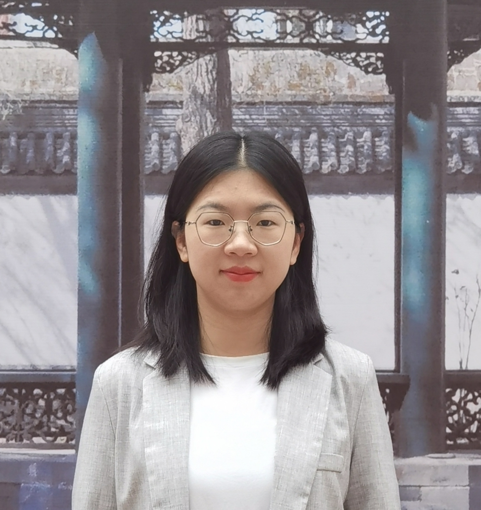

My name is Xiaomin Wang. I am a PhD student majoring in applied mathematics at Beijing Normal University. 

I am visiting the Research Group on Dynamics of Social Behavior. My research focuses on cooperation in asymmetric games. I study how heterogeneity in different dimensions of individuals affects cooperation through game theory and behavioral experiments.

I am originally from China. Outside of work, I enjoy playing badminton and watching table tennis matches. 

    <a href="mailto:xwang@evolbio.mpg.de" title="Email"><i style="font-size:24px" class="fa fa-envelope"></i></a>
    <a href="https://github.com/Xiaomin0318" title="GitHub"><i style="font-size:24px" class="fa fa-github"></i></a>

