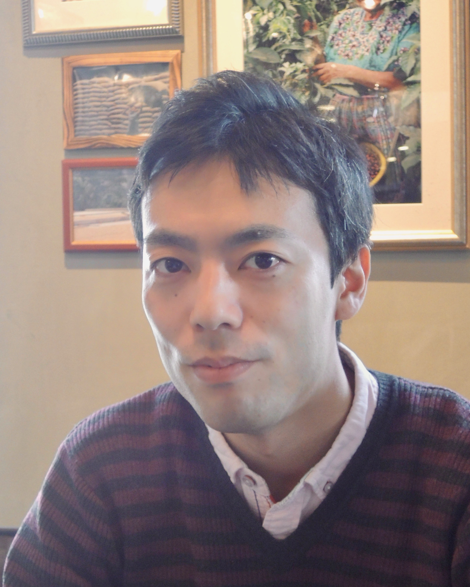

My name is Yohsuke Murase, and I am a researcher at RIKEN Center for Computational Science, Japan.
By training, I am a statistical/computational physicist and received my Ph.D. at the University of Tokyo.

I am interested in the mathematical modeling of social behaviors, social networks, and complex systems.
Especially my main focus these days is on game-theoretical problems, including direct and indirect reciprocity.
I'm interested in applying supercomputers to these problems.

I am also interested in developing software for scientific computing. [OACIS](https://github.com/crest-cassia/oacis) is one the software we are developing.

    <a href="mailto:yohsuke.murase@gmail.com" title="Email"><i style="font-size:24px" class="fa fa-envelope"></i></a>
    <a href="https://github.com/yohm" title="GitHub"><i style="font-size:24px" class="fa fa-github"></i></a>
    <a href="https://twitter.com/yohm13" title="Twitter"><i style="font-size:24px" class="fa fa-twitter"></i></a>
    <a href="http://yohm.github.io/" title="Webpage"><i style="font-size:24px" class="fa fa-home"></i></a>

