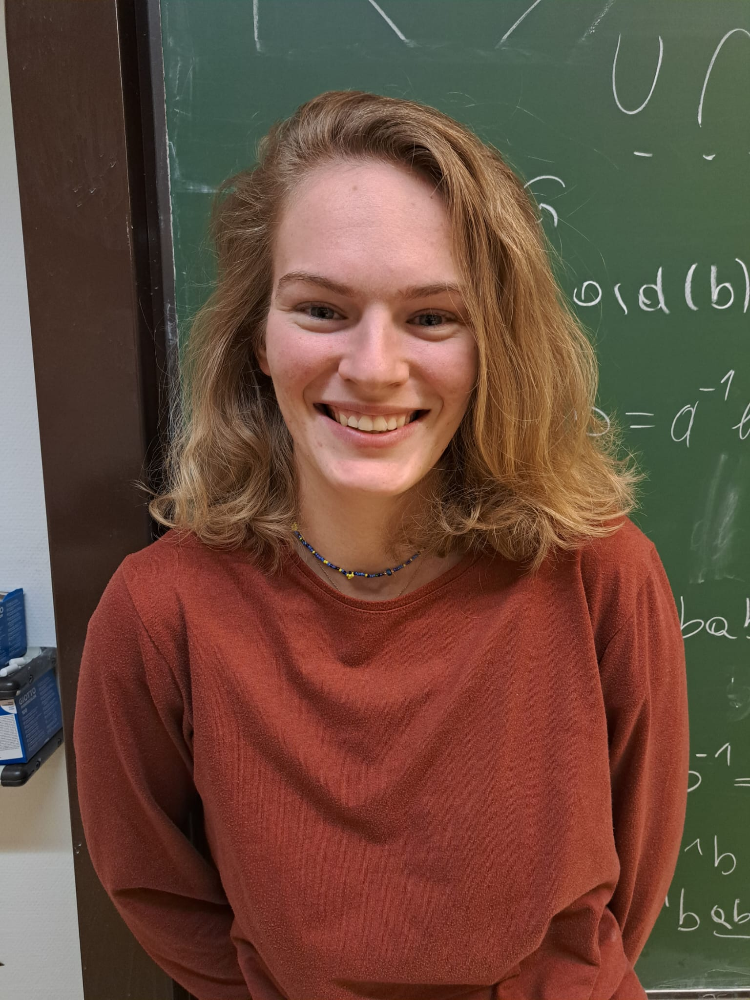

My name is Franziska Lesigang and I am a Technical Mathematics master student from Vienna. There I obtained my B.Sc. also in Technical Mathematics and wrote my Bachelor thesis on Evolutionary Game Theory.

I joined the Group Dynamics of Social Behaviour through August and September 2024 for an internship where I mostly work on reactive strategies in iterated games with $m\geq 2$ actions.

I am now back in Vienna, writing my master thesis on the results I obtained in my internship.

    <a href="lesigang@evolbio.mpg.de" title="Email"><i style="font-size:24px" class="fa fa-envelope"></i></a>
    <a href="www.linkedin.com/in/franziska-lesigang-28a057323" title="LinkedIn"><i style="font-size:24px" class="fa fa-linkedin"></i></a>

