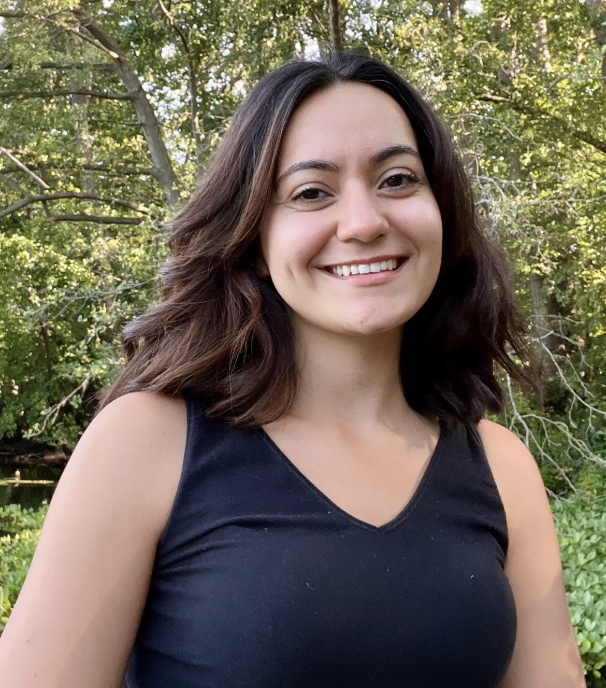

Hi, I am Adi! I am a PhD student in IT:U's research group on [Game Theory and Evolutionary Dynamics](https://it-u.at/en/research/research-groups/game-theory-and-evolutionary-dynamics/)

I am originally from Berlin but studied Psychology in Braunschweig and Göttingen. My previous work has focused on topics such as human consciousness, intuitive physics, social learning, and cultural evolution. I have experience with a wide range of experimental research methods, including computational techniques like mouse tracking, N=1 analyses, and comparative studies with chimpanzees.

I am interested in the following research questions:

<ul> <li><strong>Which contexts enable human cooperation?</strong> I investigate this by manipulating experimental contexts using pre-defined bots in a public goods game.</li> <li><strong>How does AI influence human innovation?</strong> In a world increasingly shaped by Artificial Intelligence, I am particularly interested in understanding how AI-generated solutions affect human innovation.</li> </ul>

Feel free to reach out if you would like to discuss research with me!

    <a href="mailto:adile.yasar@it-u.at" title="Email"><i style="font-size:24px" class="fa fa-envelope"></i></a>
    <a href="https://bsky.app/profile/adileyasar.bsky.social" title="Bluesky"><i style="font-size:24px" class="fa fa-twitter"></i></a>
    <a href="https://adileyasar.github.io" title="Webpage"><i style="font-size:24px" class="fa fa-home"></i></a>
     <a href="https://github.com/adileyasar"><i style="font-size:24px" class="fa fa-github"></i></a>

