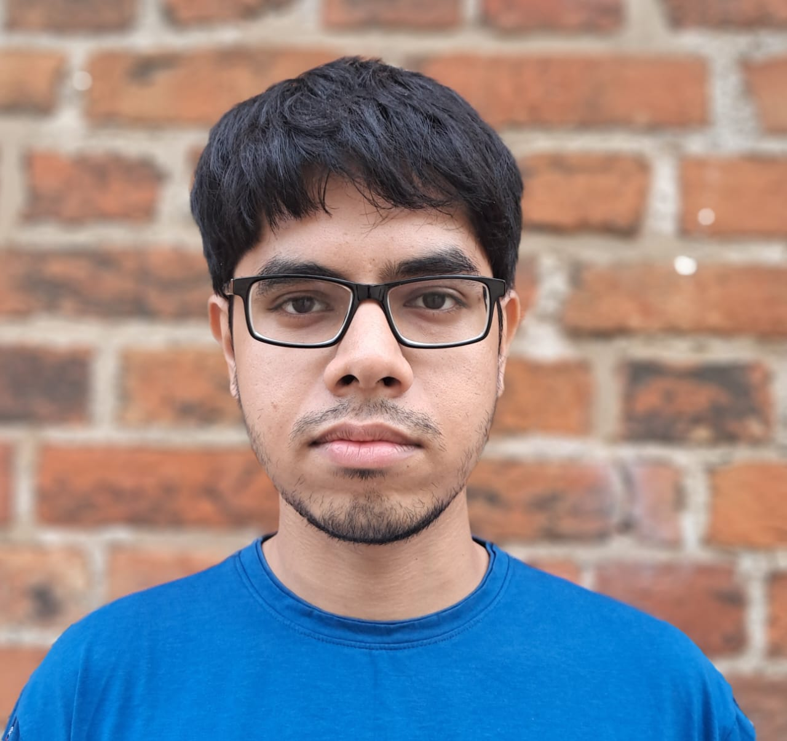

Hello, my name is Abir Utthasani, I am a doctoral researcher at Christian Hilbe's group where I study mathematical models of cooperation. I did my master's and bachelor's studies in physics from the Indian Institute of Science Education and Research Kolkata. My work here primarily focuses on the study of stochastic games to model cooperation in changing environments.

    <a href="mailto:utthasani@evolbio.mpg.de" title="Email"><i style="font-size:24px" class="fa fa-envelope"></i></a>
    <a href="https://bsky.app/profile/abirutthasani.bsky.social" title="Bluesky"><i style="font-size:24px" class="fa fa-twitter"></i></a>
  

