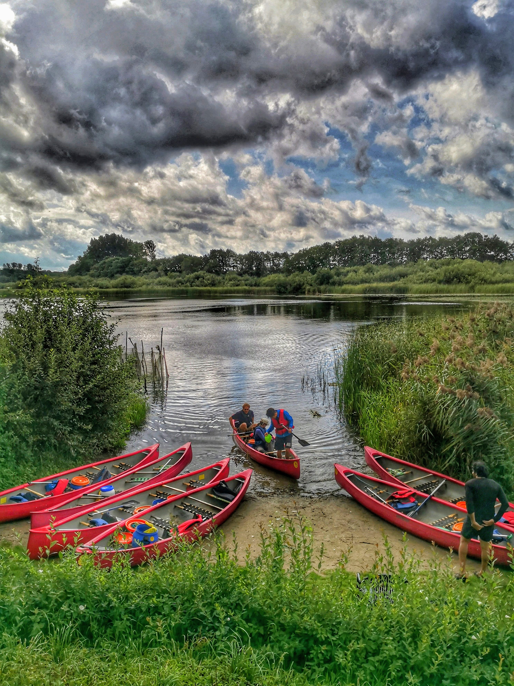

<h5>About</h5>

Max Planck Institute for Evolutionary Biology  
Department of Evolutionary Theory  
August-Thienemann-Str. 2  
24306 Plön  
Germany

<!--  -->

<h5>Code of Conduct</h5>

This code of conduct outlines our expectations for members within the research
group Dynamics of Social Behavior. We are committed to providing a welcoming and
inspiring group for all and expect our code of conduct to be honored.

As a research group we strive to:

<b>Be friendly and patient.</b>

<b>Be welcoming</b>: We strive to be a research group that welcomes and supports
people of all backgrounds and identities. This includes, but is not limited to
members of any race, ethnicity, culture, national origin, colour, immigration
status, social and economic class, educational level, sex, sexual orientation,
gender identity and expression, age, size, family status, political belief,
religion, and mental and physical ability.

<b>Be considerate.</b>

<b>Be respectful</b>: Not all of us will agree all the time, but disagreement is no
excuse for poor behavior and poor manners. We might all experience some
frustration now and then, but we cannot allow that frustration to turn into a
personal attack. It’s important to remember that a group where people feel
uncomfortable or threatened is not a productive one.

<b>Be careful in the words that we choose</b>: We are a group of professionals, and we conduct ourselves professionally. Be kind to others. Do not insult or put down other members. Harassment and other exclusionary behavior aren't acceptable. This includes, but is not limited to: violent threats or language directed against another person, discriminatory jokes and language, posting sexually explicit or violent material, posting (or threatening to post) other people’s personally identifying information (“doxing”), personal insults, especially those using racist or sexist terms, unwelcome sexual attention, advocating for, or encouraging, any of the above behavior, repeated harassment of others. In general, if someone asks you to stop, then stop.

<b>Try to understand why we disagree</b>: Disagreements, both social and technical, happen all the time. It is important
that we resolve disagreements and differing views constructively. Remember that
we’re different. Diversity contributes to the strength of our community, which
is composed of people from a wide range of backgrounds. Different people have
different perspectives on issues. Being unable to understand why someone holds
a viewpoint doesn’t mean that they’re wrong. Don’t forget that it is human to
error and blaming each other doesn’t get us anywhere. Instead, focus on helping
to resolve issues and learning from mistakes.

<h5>Research Statement</h5>

Based on the <a href="https://www.allea.org/wp-content/uploads/2017/05/ALLEA-European-Code-of-Conduct-for-Research-Integrity-2017.pdf">
The European Code of Conduct for Research Integrity</a>.

Good research practices are based on fundamental principles of research
integrity. They guide researchers in their work as well as in their engagement
with the practical, ethical and intellectual challenges inherent in research.
These principles are:

<li>Reliability in ensuring the quality of research, reflected in the design, the methodology, the analysis and the use of resources.</li>
<li>Honesty in developing, undertaking, reviewing, reporting and communicating research in a transparent, fair, full and unbiased way.</li>
<li>Respect for colleagues, research participants, society, ecosystems, cultural heritage and the environment.</li>
<li>Accountability for the research from idea to publication, for its management and organisation, for training, supervision and mentoring, and for its wider impacts.</li>

As a research group we strive to follow them.

<h5>Diversity Statement</h5>

We encourage everyone to apply to be a member of our group and we are committed to building a research group for all.

Although this list cannot be exhaustive, we explicitly honor diversity in age,
gender, gender identity or expression, culture, ethnicity, national origin,
political beliefs, race, sexual orientation, and socioeconomic status. We will
not tolerate discrimination based on any of the protected characteristics above,
including participants with disabilities.

<h5>Attribution & Acknowledgements</h5>

This code of conduct is based on the Open Code of Conduct from the Open Life
Science Community and the The European Code of Conduct  for Research Integrity. 

